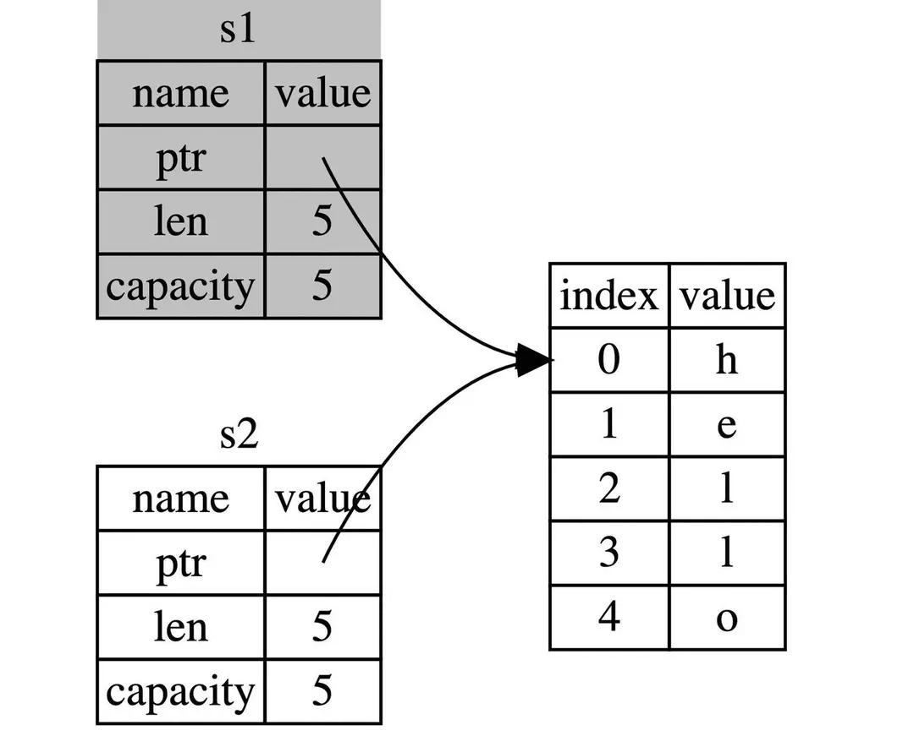

Rust 中每个值都有一个唯一的所有者owner（如上节代码let s1 = String::from("hello");中，变量s1是hello这个值的所有者），所有者拥有这个值的所有权，负责管理内存资源的分配和释放。   
Rust 通过所有权机制规定内存管理的方式，确保程序在运行时不发生数据竞争、悬垂指针等内存安全问题。  
在 Rust 中，当值被转移（或称为“移动”）给另一个变量时，原来的所有者放弃对这个值的控制，这确保了每个时刻，每个值都只有一个清晰定义的所有者。  

所有权三原则：  
1. Rust 中每一个值都被一个变量所拥有，该变量被称为值的所有者；
2. 一个值同时只能被一个变量所拥有，或者说一个值只能拥有一个所有者；
3. 当所有者(变量)离开作用域范围时，这个值将被 drop (丢弃)。

在实际的项目中通常遵循引用传递的模式，而不是直接的所有权转移，因为它可能导致不可预测的后果。

```rust

fn main() {
    let s1 = String::from("hello");
    
    // 这里s1把所有权转移给了变量s2，此时只有s2拥有所有权，也就意味着s1已失效
    let s2 = s1;        
    
    // 在这里打印s1会失败，因为它已失效
    // println!("{}, world!", s1);

} //在这里触发所有权第3个原则，即 drop 掉s2变量，释放内存
```

字符串hello位于堆内存，变量s1拥有该值的所有权，由于 s1 把所有权转移给了s2，所以 s2 拷贝了一份 s1 的信息，并重新在栈内存中记录了字符串的指针、字符串长度及容量信息，这个操作也叫做”浅拷贝“，即只拷贝引用，不拷贝数据；  
按照所有权三原则第2条：一个值只能拥有一个所有者，此时 s1 失效，s2 拥有字符串的所有权。  
总的来说，所有权的转移（move）涉及2个部分：浅拷贝 + 旧变量失去所有权（这个是最容易被忽略的）。  

