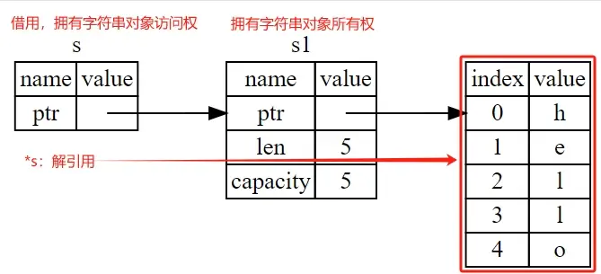

借用(Borrowing)：是指通过引用来获得数据的访问权，而不是所有权，用符号&表示。  
借用使得可以在不转移所有权的情况下，让多个部分同时访问相同的数据。  
Rust 的借用分为可变借用（mutable borrowing）和不可变借用（immutable borrowing）两种形式。  
解引用：是借用的一个重要操作，允许通过引用获取到被引用值的实际内容，简单来说，就是获取到借用的对象的值。用符号*表示。  

```rust
// 不可变引用，获取值的长度
fn calculate_length(s: &String) -> usize {
    s.len()
}

// 可变引用
fn change(some_string: &mut String) {
    some_string.push_str(", hackquest.");
}

// 悬垂引用（编译不通过）
// 离开函数体作用域后，变量s的内存空间会被自动释放掉，此时&s就成为无效指针（悬垂引用），因此会编译失败
fn dangle() -> &String {
    let s = String::from("hello");      // 创建拥有字符串所有权的变量s
    &s                                  // 返回对象的借用
} 

fn main() {
    let s1 = String::from("hello");

    let len = calculate_length(&s1);                    // &s1 即不可变引用（默认），也就是在函数中我们只能读取对象，而不能修改对象
    println!("The length of '{}' is {}.", s1, len);

    let mut s2 = String::from("hi");                    // &mut s2 即可变引用，所以 change 函数可以修改该值
    let r1 = &mut s2;
    change(r1);

    // let reference_to_nothing = dangle();             // 试图访问悬垂引用的对象，编译失败
}
```

借用其实就是存储了字符串对象的内存地址指针
```rust
// 变量s1拥有字符串的所有权，类似于你拥有一辆特别酷炫的车
let s1 = String::from("hello");

// 借用，通过 &s1 获得字符串的访问权，类似于朋友从你那里把这辆车借走了
// 但是车还是你的
let s: &String = &s1;

// 解引用，通过 *s 获的借用的对象的值
// 类似于你朋友把车开到大街上向别人展示：看，我借到了一辆特别酷炫的车！
println!("s1 = {}, s = {}", s1, *s);
```

