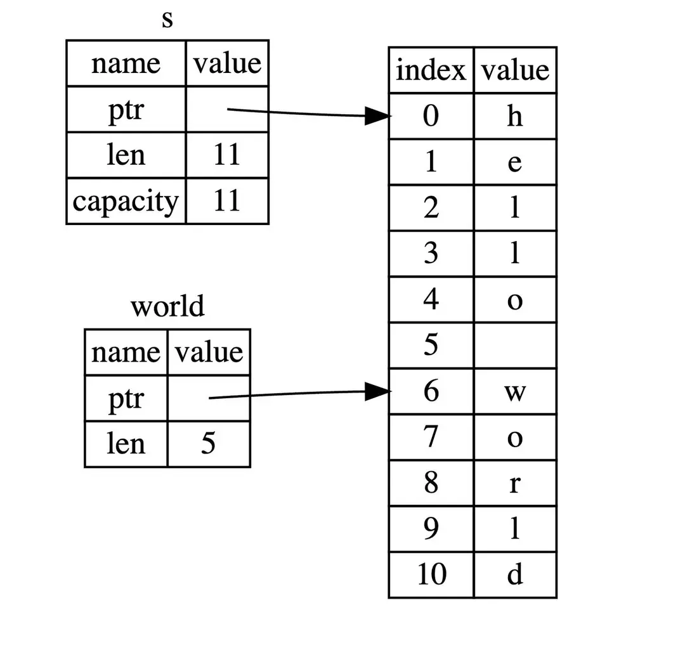

切片（slice）：是一种引用数据结构，它允许你引用数据的一部分而不需要拷贝整个数据。切片通常用于数组、字符串等集合类型。  
字符串切片（String slice）：是一种特殊的切片，专门用于处理字符串。  
字符串切片的类型是 &str。它可以通过索引或范围来指定字符串的一部分。字符串切片提供了对字符串的引用，而不引入额外的内存开销。  


```rust
// 该字符串分配在内存中
let s = String::from("hello world");

// hello 没有引用整个 String字符串 s，而是引用了 s 的一部分内容，通过 [0..5] 的方式来指定。
let hello: &str = &s[0..5];
let world: &str = &s[6..11];

let s = "你好，世界";
let slice = &s[0..3];           // 结果是："你"，因为 &s[start..end]切片是基于字节索引的。在 UTF-8 编码中一个汉字占 3 个字节
```
创建切片需要通过 [开始索引..终止索引]来指定范围，代表的数据范围包含开始位置，但不包含结束位置，即前闭后开；同时索引位置从0开始。  
注意：  
&s[start..end]切片是基于字节byte索引的。


