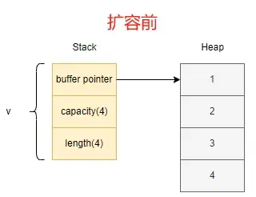
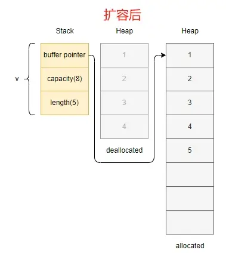

动态数组Vec<T>是一种灵活的数据结构，允许在运行时动态改变大小。所以它的长度是可变的，可以根据需要动态增加或减少元素  

创建动态数组的方式：
```rust

let v1: Vec<i32> = Vec::new();          // 1.显式声明动态数组类型

let mut v2 = Vec::new();                // 2.编译器根据元素自动推断类型，须将 v 声明为 mut 后，才能进行修改。
v2.push(1);

let v3 = vec![1, 2, 3];                 // 3.使用宏 vec! 来创建数组，支持在创建时就给予初始化值

let v4 = vec![0; 3];                    // 4.使用 [初始值;长度] 来创建数组，默认值为 0，初始长度为 3            v4 = [0, 0, 0];

let v5 = Vec::from([0, 0, 0]);          // 5.使用from语法创建数组
assert_eq!(v4, v5);
```

动态数组扩容：
```rust
fn main() {
    let mut v: Vec<i32> = vec![1, 2, 3, 4];
    
    println!("v's capacity is {}", v.capacity());                   // prints 4，即数组的初始容量是4
    println!("Address of v's first element: {:p}", &v[0]);          // 打印内存地址
    
    v.push(5);
    
    println!("v's capacity is {}", v.capacity());                   // prints 8，数组进行扩容，容量变成8
    println!("Address of v's first element: {:p}", &v[0]);          // 打印扩容后的内存地址，会发现跟上面的地址并不相同
}
```

